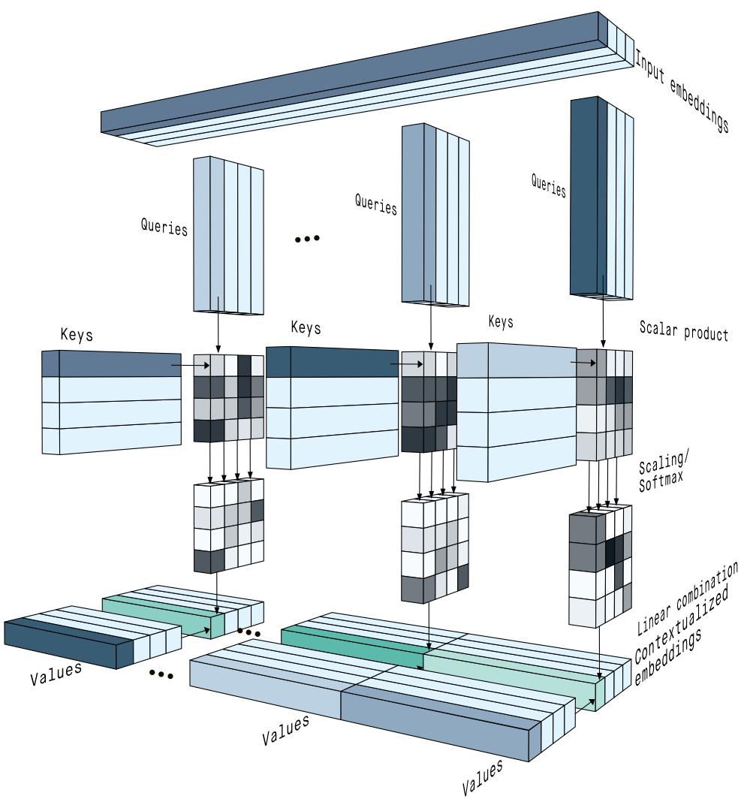
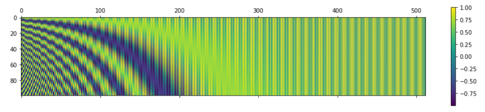
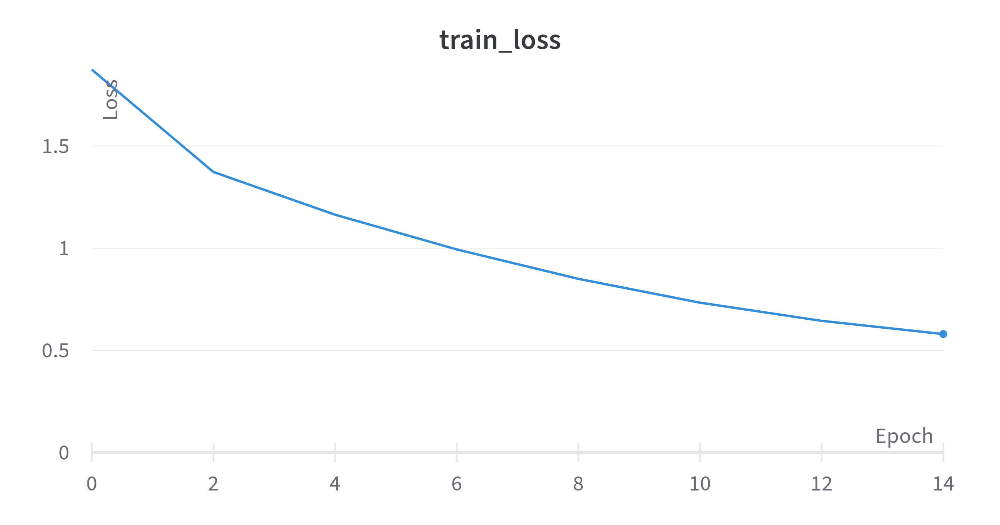
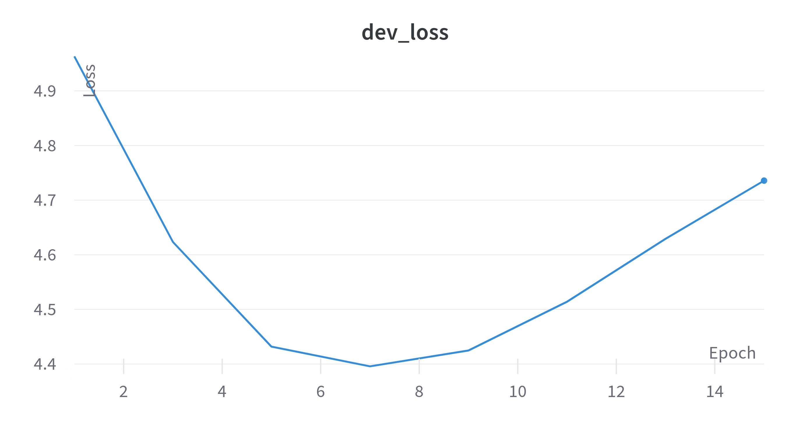
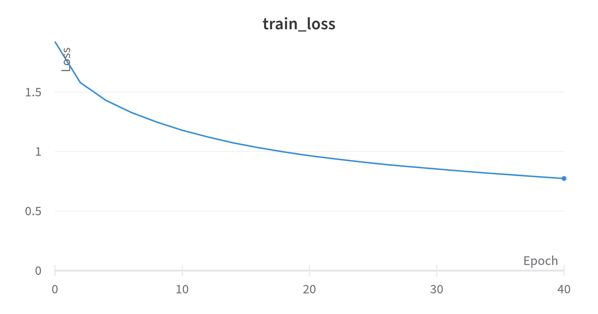
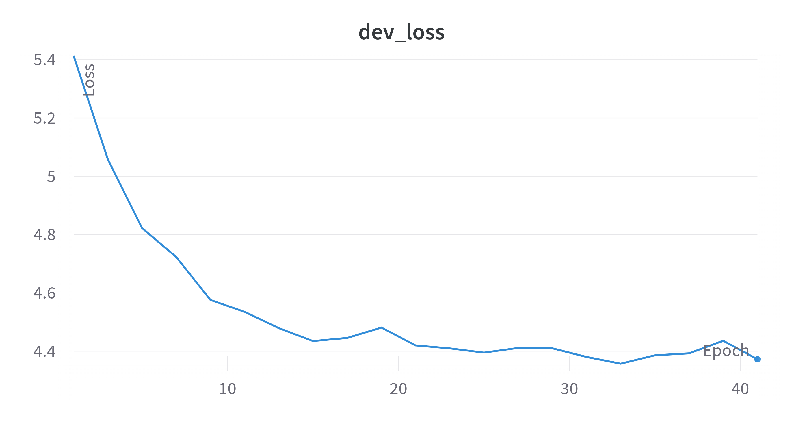
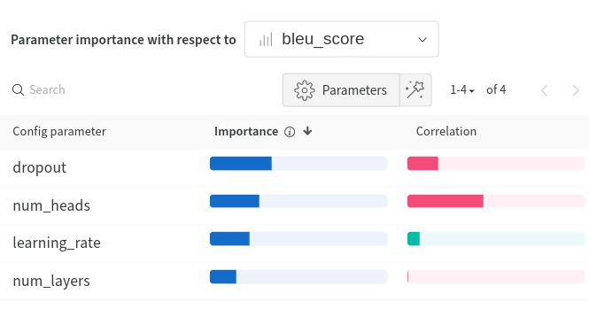

# Assignment 3 - ANLP

Shubh Agarwal \
2020101131

## 3.1 Theory

### 1. What is the purpose of self-attention, and how does it facilitate capturing dependencies in sequences?

Self-attention is a technique that enables each element of a sequence to attend to other elements directly, without processing them in a fixed order. This helps the network learn the dependencies between distant regions of the sequence and understand the sentence better.

Self-attention works by creating three vectors for each element of the sequence: query, key, and value. These vectors are obtained by multiplying the input vector with three learned matrices. The query vector is then multiplied with all the key vectors to get a matrix of attention scores, where each row represents an element and each column represents another element. This matrix shows how much each element pays attention to another element. The value vectors are then weighted by the attention scores and summed up to get the final output.

Self-attention can also capture long-range dependencies, which are often hard for recurrent or convolutional networks to handle. For example, in a sentence like “The boy who wore a blue shirt yesterday went to the park today”, self-attention can help the network link “the boy” with “went to the park”, even though they are far apart. This is because self-attention computes the attention scores for all pairs of elements at once, instead of processing them one by one. This way, self-attention can capture the global meaning and structure of the sequence, regardless of its length or order.

### 2. Why do transformers use positional encodings in addition to word embeddings? Explain how positional encodings are incorporated into the transformer architecture.

Transformers use positional encodings to add information about the order and position of the words in a sequence. Unlike recurrent or convolutional neural networks, transformers do not process the input sequence sequentially, but rather attend to all words in parallel. Therefore, they need some way to encode the relative or absolute position of each word, so that they can capture the context and meaning of the input sequence.

Positional encoding helps remove the consequent 'bag of words' input which would occur if only word embeddings would have been used as input. But, we want the model to know the order or the relative order a little bit but also to be of a small difference so that it doesn't change the embeddings too much for the same word far away in the input sequence.

Positional encodings are vectors that represent the position of each word in the sequence. They have the same dimension as the word embeddings, so that they can be added together. The positional encodings are incorporated into the transformer architecture by adding them to the word embeddings before feeding them to the encoder and decoder layers. The self-attention and cross-attention sub-layers use the positional encodings to compute the attention scores between different words in the sequence.

## 3.2 Implementation and Training

### 1. Model Architecture

#### Hyperparameters

| Key            | Value   |
| -------------- | ------- |
| batch_size     | 32      |
| context_size   | 64      |
| dropout        | 0       |
| embedding_dim  | 128     |
| epochs         | 100     |
| learning_rate  | 0.001   |
| num_heads      | 2       |
| num_layers     | 2       |
| optimizer      | "Adam"  |

#### Attention Mechanism

The attention mechanism used is the scaled dot-product attention. The query and key vectors are multiplied together and then divided by the square root of the dimension of the key vectors. Masking is added to the padding values of the Query and Key matrices. The softmax function is applied to the resulting matrix to get the attention scores. Further, NAN values are changed to 0. The value vectors are then weighted by the attention scores and summed up to get the final output.

For decoder self-attention, another masking is applied to the attention scores matrix to prevent the decoder from attending to future words. This is done by masking the upper triangular part of the matrix.

#### Feed Forward Network

The feed forward network consists of two linear layers with a `ReLU` activation in between. The first linear layer projects the input to a higher dimensional space (4 * `embedding_dimension`), and the second linear layer projects it back to the original dimension.

#### Early Stopping

Early stopping is used to prevent overfitting. The model is trained for 100 epochs, and the training is stopped if the validation loss does not decrease for `3` epochs with a delta of `0.001`.

#### Loss Function

The loss function used is the `CrossEntropyLoss` function. I have used the `ignore_index` parameter to ignore the padding tokens while calculating the loss for validation and testing. But I have not used it while calculating the loss for training so that the model learns to predict the padding tokens as well as the embeddings are trained from scratch.

## 3.3 Analysis

### Loss for the original hyperparameters

**Loss:** 3.943 \
**BLEU Score:** 0.118

### Hyperparameter tuning

I set the following hyperparameters as static:

| Parameter      | Value                   |
| -------------- | ----------------------- |
| epochs         | 100                     |
| embedding_dim  | 128                     |
| batch_size     | 32                      |
| context_size   | 64                      |

I tuned the following hyperparameters:

| Parameter      | Values                  |
| -------------- | ----------------------- |
| learning_rate  | 0.0005, 0.001           |
| dropout        | 0.0, 0.15, 0.3          |
| optimizer      | 'Adam', 'RMSprop'       |
| num_layers     | 2, 3                    |
| num_heads      | 2, 4, 8                 |

### Loss for the best tuned hyperparameters

**Loss:** 3.868 \
**BLEU Score:** 0.155

### Importance of hyperparameters

We can see that dropout and number of heads is playing a major role in the performance of the model. Both have a negative correlation indicating that having a lower value is beneficial as a whole. The reason for this could be that the model is trying to generalise, but the training data is low for it to give a good performance. So, it is better to have a lower dropout.

The number of heads also shows a negative correlation. This is probably because of the embedding dimension size. Due to the small size of the embedding dimensions, having more number of heads will lead to embeddings provided for each head to be of such a small size that it loses information rather than retains the information about the word. So, it is better to have a lower number of heads.

The learning rate shows a small correlation. This could be because I have not provided a big learning rate. The biggest is the average learning rate which is usually provided: 0.001.